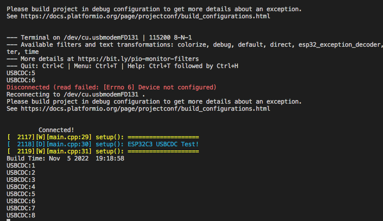
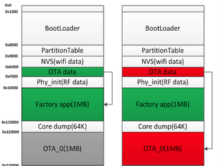
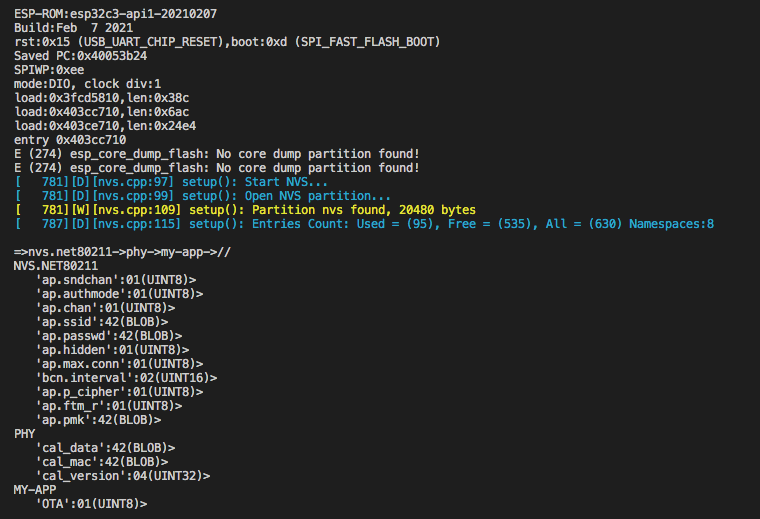
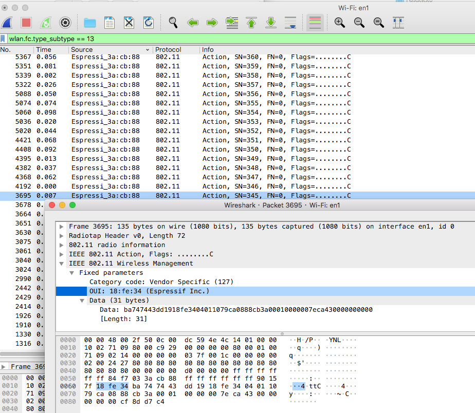

## LuatOS USBCDC Project 
### Copy luatos-cdc.json to .platform/platforms/boards, build and update! 

## Factory OTA Project 
### Switching between factory and APP partition
 

## NVS test Project 
### list keys in each NVS/Preference namespace

## QuickEspNow w/ LED Sync
### Sync multiple devices' LED with QuickEspNow broadcasting
the middle one is the latest board added to the group!
Project dependancy: QuickEspNow, SimpleMap
Features:member drop/add detection, time sync, optional binary MessagePack 
