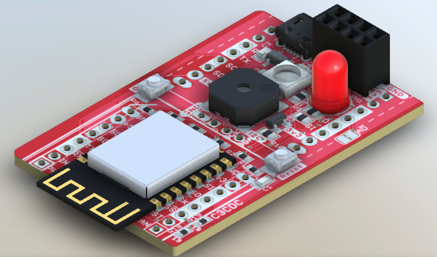

# JimmyCraft C3MikroBUS/C3Pico 
JimmyCraft Kits for ESP32C3 && PP2040 w/ mikroBUS
 

----
## Project C3MikroBUS V0 
ESP32C3 + mikroBUSx2  

### C3MikroBUS kit!
FEATURES
- AiThinker ESP32C3-12F on mikroBUS
  + RISC-V single core processor runninig on 160 Mhz
  + 384K ROM, 400K SRAM, 8K SRAM in RTC, 4MB flash
  + 2.4 GHz WiFi (802.11 b/g/n) 1T1R up to 150 Mbps, Bluetooth 5, Onboard antenna
  + RESET & BOOT button
  + Neopixel RGB LED, 65dB buzzer, optional status-LED/photo-sensor
  + Connectors SPIx1, I2Cx1, UARTx1, GPIOx3 on mikroBUSx2
- Connectors OLED-I2Cx1, nRF24SPIx1 
- microUSB-B connector for C3CDC Debugging and Programming, 600mA 3.3V regulator

----
## Project C3PicoMikroBUS V1 
ESP32C3 + mikroBUSx2 + Rpi-Pico  

### C3Pico-MikroBUS kit!
FEATURES
- AiThinker ESP32C3-12F on mikroBUS
  + RISC-V single core processor runninig on 160 Mhz
  + 384K ROM, 400K SRAM, 8K SRAM in RTC, 4MB flash
  + 2.4 GHz WiFi (802.11 b/g/n) 1T1R up to 150 Mbps, Bluetooth 5, Onboard antenna
  + RESET & BOOT button
  + Neopixel RGB LED, 65dB buzzer, optional status-LED/photo-sensor
  + Connectors SPIx1, I2Cx1, UARTx1, GPIOx3 on mikroBUSx2
- Connectors OLED-I2Cx1, nRF24SPIx1 
- 2 half-mount holes  
- microUSB-B connector for C3CDC Debugging and Programming, 600mA 3.3V regulator
- RPi-Pico 40pin connector (optional RP2040, 16MB qspi-flash)
  + uSD/TF card slot

[Project C3Pico-mikroBUS V1 Link]()

---
## Project C3PicoProto V0 
ESP32C3 + mikroBUSx4 + RPi-Pico + Proto + LCD  
 
Additional FEATURES
- mikroBus +2
- CP2102 USBtoUART x1, FTDI-pin-connector x1, microUSB-B x1(optional C3CDC)
- AMS1117 800mA 3.3V regulator x1
- level-shifter x4, Grove-I2C x2 (optinal I2C level-shift)
- JTAG-1.27mm 2x5
- DIP-SPI-LCD connector w/ touch x1
- .5mm 20Pin FPC connector x1
- 2.54mm/100mil proto area 16x7
- Mount hole +1

[Project C3Pico-Proto Link]()

---
## References  
[mikroBUS™] (https://www.mikroe.com/mikrobus) 
[WOWKI ESP32 simulator] (https://docs.wokwi.com/guides/esp32) 
[WOWKI RP2040 PicoSDK simulator] (https://wokwi.com/projects/new/pi-pico-sdk) 
[WOWKI RP2040 microPython simulator] (https://wokwi.com/projects/300504213470839309) 
[JimmyCraft C3MikroE simulator w/ WOWKI](https://github.com/jmysu/C3MikroE_Wokwi) Customized WOWKI board 
[JimmyCraft C3MikroBUS Arduino projects w/ PlatformIO](https://github.com/jmysu/ESP32C3_Pico) Compatible w/ all C3MikroBUS kits!
